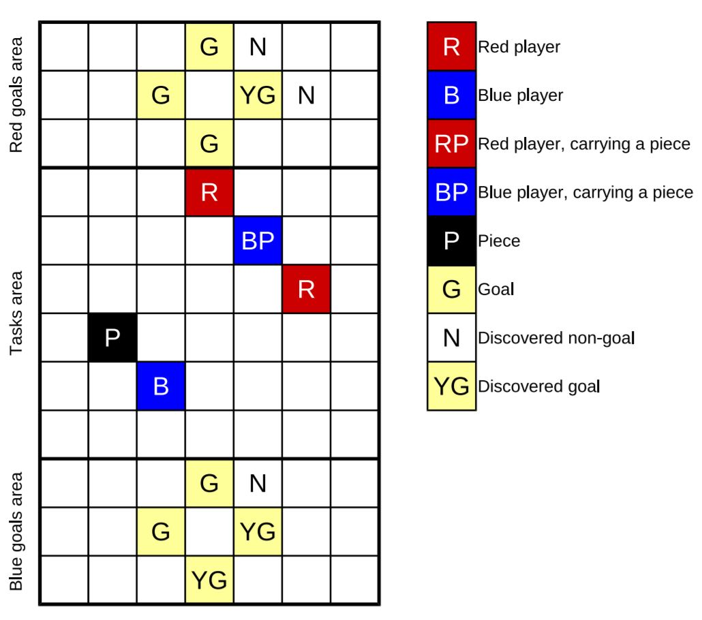
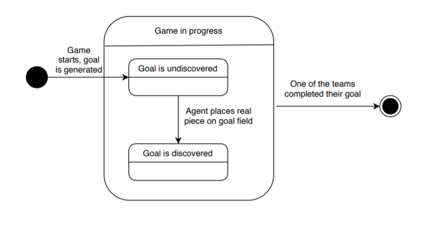
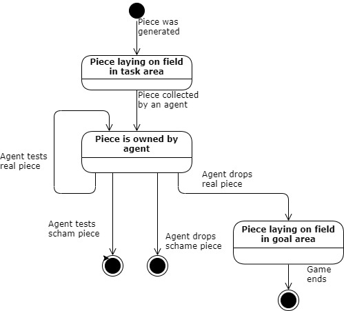
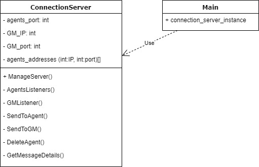

---
author:
- Palina Hrynko
- Tomasz Kostowski
- Karol Klimaszewski
- Piotr Kowalik
- Krzysztof Kicun
---

# Introduction

The system organizes matches between teams of cooperating agents. The
game is played in real time on a rectangular board, consisting of the
tasks area (a part of the board from which the Agents may collect the
pieces) and the goals area (a part where the Agents place the pieces).
The goal of each team of agents is to move a set of pieces from picked
from the tasks area to the project goals area. The pieces appear at
random places on the tasks area. Each agent holds its own limited view
of the state of the game. The shape of the pieces needs to be
discovered. The game is won by the team of agents which is first achieve
the goal.

## Glossary

-   **Game Master** - a process that generates the board and the shape
    of the project goals, maintains the state of the game, provides an
    interface for agents to change said state and presents game progress
    to the user.

-   **Agent** - a bot playing the game, holds its own view of the state
    of the game.

-   **Leader Agent** - an agent whose request for communication between
    another agent cannot be declined.

-   **Communications Server** - responsible for passing messages between
    Game Master and Agents.

-   **Tasks Area** - a part of the board from which the Agents may
    collect the pieces.

-   **Goals Area** - a part of the board where the Agents place the
    pieces. Each team has it's own goal area.

-   **Piece** - a token representing the project resource which is
    placed in the Tasks Area of the board by the Game Master, picked
    from the Tasks Area by one of the Agents and placed by that Agents
    in the Goal Area.

-   **Game Goal** - discovering the shape of the project goal by placing
    a set of pieces in the Goal Area.

-   **Discovery** - Agent's action. Revealing the distance to the
    nearest piece of 8 neighbouring fields.

-   **Agent's communication** - Passing board vision from one agent to
    another.

## Game concept

The game should simulate the following properties of projects
development:

-   moves and tasks of agents are connected with risks (usually
    negative)

-   pieces and goals of the project are unclear (and need to be
    discovered)

-   agent's communication helps to speed up the game.

The risk of doing a move is simulated by a probability that a given
piece is a sham. The agent can discover that fact either by testing a
piece (which it currently holds) or by placing it in the goal area and
not receiving any feedback, about that field being a part of a project
goal or not.

The difficulty of project is simulated by the size of the goal area on
board, the shape of the fields in which the pieces need to be placed and
the number of those fields.

The cooperation between the agents is simulated by the ability to
exchange board vision and having a common goal. Only through the
communication agents can get access to the information about the project
goals completed (or misinterpreted) by other agents.

## System concept

The Project Game system consist of the three main components: Agents,
Game Master and Communication Server.

The Agents and the Game Master connect to the Communications Server.
Game Master is responsible for managing the game and rules, while
Communications Server for managing the communication at the lower level
by passing the messages between the Agents and Game Master without
processing their content. The Agents interact with the Game Master and
one another in order for their team to complete the game as fast as
possible.

# Game rules

Piece is a token. Placement pieces in all team goal fields means win.
Piece can be sham. Sham piece acts as normal piece during picking up and
moving. Placing sham piece means nothing. Pieces come up regularly on
task area.

Board is a rectangle consisting of fields. Fields are equal-sized
squares. Upper part of board is red team goal area, bottom part of board
is blue team goal area. Both goal area have equal size. Middle part is
tasks area.

Fields on goal areas can be goal fields. There is equal amount of
goal-fields on both goal areas. First team to place pieces in all owns
goal fields wins the game.

The game is played on a board. The true current state of the board is
known only to the Game Master. The Agent initially knows only if he is
the leader, dimensions of board, his own position and Manhattan distance
to the nearest piece. He doesn't know, where are goal fields and how
many agents there are on the board and where they are.

Possible moves of the Agent:

-   Moving in one of 4 directions,

-   Discovering the contents of 8 neighbouring fields,

-   Testing the picked piece for being a sham,

-   Request exchange of information with another agent.

-   Answer requests from other Agents, Agent is forced to answer if the
    leader is requesting,

-   Placing a piece in the goals (placing pieces in task area is
    forbidden), in hope of completing one of the project objectives:

    -   Piece placed not in goal field results in an information that
        the completed action has been meaningless, in the sense of
        project completion.

    -   Piece placed in goal field results in an information to the
        Agent that one of the goals of the project have been completed.

    -   Placing a piece which is a sham results in getting no
        information.

Agent actions have following ramifications and constrains:

-   The piece is picked up by a Agent which moves into the piece's field
    first.

-   Agent cannot move into a field occupied by another agent.

-   Discovering or entering field results in receiving information about
    the Manhattan distance to the nearest piece.

-   Performing actions take appropriate time. This time is set before
    start of game and depends on action type.

# Use cases

We identified 4 actors (system components that can make certain
decisions affecting the game):

-   User

-   Game Master

-   Agent (bot/player)

-   Agent-leader

User is a person in front of the computer that launches the game and
watches it progress.

User can set Game Master process attributes and start it. User can also
launch agent processes and configure their attributes. These attributes
include which team agent should join and a way to connect to the Game
Master.

Game Master can start the session and usually does it right after being
launched. Starting the session includes generating the board according
to the parameters specified by user during Game Master setup. The Game
Master also provides a way for agents to connect to itself and waits for
agents connection requests. Whenever Game Master receives a connection
request he can decide whether it should be accepted or not. The decision
is based on configuration and current state of teams.

The Game Master can decide to start the match if appropriate number of
agents is connected.

During the match the game master can make following decisions:

-   Whether or not to generate a piece and where to generate it.

-   How to respond to agents actions (allow the agents to take requested
    actions or prevent them from doing it) and for how long should the
    agent be blocked after performing an action.

-   Whether or not the game is over. If it is over, Game Master should
    decide the winner and inform the agents.

The Game Master can also end the session, disconnecting all agents and
ending the process.

Agents are independent processes that are started by the user. Agents
connect to the Game Master. Groups of agents form teams that compete
against each other. Agents have limited view of the board (After every
move distance to the nearest piece is sent to them). They can interact
with the board in various ways by sending appropriate messages to Game
Master. Agents make decisions about their actions according to
configured strategy.

The agents can decide to perform the following actions:

-   Move (Change position on the board of deciding agent by 1 in one of
    the cardinal directions).

-   'Discovery' (Reveal the distance to the nearest piece of 8
    neighbouring fields).

-   Interact with the piece:

    -   Pick up the piece that the agent is standing on.

    -   Drop held piece on the agents location.

    -   Check whether held piece is a sham.

-   Communicate with other agents on their team:

    -   Request information exchange.

    -   Agree to or decline information exchange

The leader is special type of agent. There is one leader on each team.
When leader send a request for information exchange asked agent cannot
decline.

Figure [1](#fig:useCasesDiagram){reference-type="ref"
reference="fig:useCasesDiagram"} is an UML Use Case diagram visualy
depicting decisions that each of the identified actors can make.

{#fig:useCasesDiagram
height="\\dimexpr \\textheight - 4\\baselineskip\\relax"
width="\\textwidth"}

# General game schema

## GM states

{#fig:Game State Diagram
height="\\textheight"}

During his activity Game Master goes through 3 complex states:

-   At the beginning he enters **prepare game** state: In it he first
    enters **waiting for communication server** state. When
    communication server is up and ready to exchange messages he enters
    **waiting for appropriate number of connected agents** state. When
    number of agents specified in configuration is connected for both
    teams he enters **game master prepares map** state. After map is
    prepared game is considered prepared and ready to start.

-   Then he enters **game in progress** state. There he is constantly in
    **game master handles agents requests** state in which he receives
    action requests from agents, performs these actions and manages
    communication between agents. He does this until one of the teams
    fills all their goal fields which means the match is over.

-   After that he enters **finish game** state in which final cleanup is
    performed. There he is in **preparing and sending summaries to all
    agents** state. He sends to all agents messages containing
    information about who won and other match details. When that is done
    and those messages are delivered to all agents Game Master enters
    end state

Figure [2](#fig:Game State Diagram){reference-type="ref"
reference="fig:Game State Diagram"} depicts states described above and
transitions between them.

## Agent in GM states

{#fig:Agent State Diagram width="\\textwidth"}

When agent connects to Game Master it's state in Game Master is set to
**agent connected**. When the game starts all connected agents enter a
complex state **game in progress** in which they can go through multiple
different sub states.

At the start they enter **agent prepares an action state**. Agent
processes are informed about this by game master sending them a message
that tells them they can move (This message may include information
related to agent's previous action).

When agent sends his next action it is saved, his next action time is
updated depending on type of action sent and he enters a **blocked**
state.

If while being in a **blocked** state current time reaches agent's next
action time, then depending on type of his next action:

-   If it is not request for communication: action is performed, he
    reenters **agent prepares an action** state and along with message
    asking him for his next move he gets sent results of this action.

-   If it is request for communication: He enters **agent is requesting
    communication** state and a message is sent to the other agent
    asking if they want to communicate

    -   If they don't want to: agent reenters **agent prepares an action
        state** and along with message asking him for his next move
        information that request was declined is sent.

    -   If they want to: Game master waits until asked agent is
        unblocked and his action that was the reason of this block is
        performed and asking agent enters **asking agent is preparing
        their communication data** state.

        In that state both agents next allowed move times are updated,
        and asking agent is told to send their communication data.

        When Game Master receives this data asking agent enters **asking
        agent waiting for communication data** state

        In that state asking agents communication data is sent to asked
        agent and asking agent is told to send their communication data.

        When Game Master receives this data he waits until asking agent
        can move again and sends this data to asking agent. Asking agent
        reenters **agent prepares an action** state

If while being in a **blocked** state agent receives a request for
communication he enters **agent is responding to communication request**
state and:

-   He can decline it: it will return him to **blocked** state

-   He can agree to it: Game master will wait until his next action time
    is reached, perform his next action and send him results of this
    action. However Game Master will not ask agent for his next move
    like in **agent prepares an action** state. He will enter **asked
    agent is communicating** state.

When communication is complete he will return to the **blocked** state
with next action time set according to asking agent's state but without
an action to perform at the end of that time.

If one of the teams completes their goal, which means game is complete
agent exits **game in progress** state and whichever sub state of game
in progress he was in and enters end state. Figure
[3](#fig:Agent State Diagram){reference-type="ref"
reference="fig:Agent State Diagram"} depicts states described above and
transitions between them.

# Agents demands and delays

## Demands and delays

{width="\\textwidth"}

To perform action agent must sent message to Game Master via
Communication Server. Game Master, knowing type of agent's demand, waits
predefined amount of time, next, if action can be performed, action is
made and Game Master changes state of game. Finally, Game Master sends
message back to agent, with information if action was successful.

{width="\\textwidth"}

This diagram shows in detail how Game Master handle demands from many
agents. In infinitive loop Game Master collect new demands, if there are
any of them Game Master save them with time when they can be performed.
Next Game Master check if there are saved actions with time prior to
current and if so, it performs it and send message back to agent. This
loop works during whole game.

## Agent-agent information exchange

{#fig:Communication Sequence Diagram
width="\\textwidth"}

Figure [4](#fig:Communication Sequence Diagram){reference-type="ref"
reference="fig:Communication Sequence Diagram"} depicts how and when
different messages are sent to exchange information between
communicating agents.

When both agents agree to exchange their knowledge about the board (or
one agent is forced to do so), the process of knowledge exchange starts.
Let's name agent that sent the request for information exchange asking
agent and agent that received this request asked agent.

At the start of the process we assume that asked agent just sent message
to the game master agreeing to communication and asking agent received
information that his request for communication was approved.

Asking agent gathers its knowledge about the board and sends it to Game
Master. This knowledge includes:

-   Two dimensional array of integers of dimensions equal to dimensions
    of the board in which each element is known distance to the nearest
    piece of board field in that position (-1 on fields where distance
    is unknown)

-   Same sized array in which each element is integer indicating how old
    (in seconds) is knowledge about that fields distance to the piece

-   Agent's id, position and whether they are holding a piece for each
    agent that sending agent has info about and how old (in seconds) is
    that info. This includes info about asking agent.

-   Positions of discovered goal fields and of fields known not to be
    goal fields.

Game Master relays this message to asked agent as soon as he can. Asked
agent then sends his knowledge about the board to the Game Master. Game
Master waits until asking agent can move again and relays this message
to asking agent. This message is also an information to asking agent
that he can move again. At the same time Game Master waits until asked
agent can move again and send message to him when he can.

{#fig:Communication Activity Diagram
width="\\textwidth"}

Figure [5](#fig:Communication Activity Diagram){reference-type="ref"
reference="fig:Communication Activity Diagram"} depicts how different
components of the system handle communication exchange between two
agents from start to finish.

First agent asks second agent to exchange information. This request is
received and processed by Game Master.

Game Master checks whether agent 1 is leader and sends appropriate
message to agent 2.

Agent 1 checks whether received message is from leader and if it is he
sends message agreeing to information exchange immediately or if it is
not deciding whether to agree to it or not.

If he doesn't agree to it he sends message about it to Game Master, who
relays it to Agent 1 and communication ends.

If he agrees to it, automatically or not, he also sends message about it
to Game Master, who relays it to Agent 1 and also asks him to send his
board knowledge.

Agent 1 gathers and sends his knowledge. Game Master relays this
knowledge to Agent 2. Agent 2 saves this knowledge and sends his
knowledge. Game Master again relays this knowledge to Agent 1.

Agent 1 save this knowledge and communication is complete.

# User use cases

# Rules of booting up the game

Communication server launching with 1 parameter: port number. Game
master constructor taking configuration parameters. If none are passed
to the constructor, default parameters are taken. Default parameters are
stored in json format, with fields like: \"teamsNumer\", \"agentDelay\",
\"minimumAgents\", \"leadersNumber\".

Function creating board and goals will also have input parameters or
default settings in json format. For ex. \"areaWidth\",
\"taskareaHeight\", \"goalareaHeight\",\"goalsNumber\". To launch agent
we need to pass two arguments: boolean deciding whether agent is leader
of the team or not and team number.

After all agents are connected, they receiving information about
dimensions of the board and information about nearest piece.

The game will print out the communicate after launching every component
of the game, generating board. Game will also print every message
Communication Server processing converted to string.

Default configuration will be stored in remote git repository.

# FURPS

## Usability

To run Communication Server and Agents user has to use console, Game
Master has simple GUI in WPF/WinForms. All logs, and GUI controls in
English.

## Reliability

Communication errors are described in \"Exceptions\" section. Incorrect
messages are ignored by Game Master and by Agents.

## Performance

System should be able to run Game for teams up to 20 agents each and
board size up to 100x200.

## Supportability

Game Master logs into .txt file. All code is written in C\#.
Environment: Windows. Communication between moduls via TCP protocol.

# Architecture

## Modules

The Project Game system consist of the three main components: Agents,
Game Master and Communication Server.

The Agents and the Game Master communicate to each other via
Communications Server, using TCP protocol. Game Master is responsible
for managing the game and rules, while Communications Server for
managing the communication at the lower level by passing the messages
between the Agents and Game Master without processing their content.

## Class diagrams

### Agent Module

1.  Agent class is responsible for:

    -   storing information received from Game Master,

    -   storing and execution of agent strategy.

    Contained objects are:

    -   two dimensional array of Field objects stores received
        information about map. It's size is the same as Game Master map.

    -   object of type Strategy which is responsible for storing and
        executing agent's strategy

    -   isLeader- boolean field indicating if agent is leader

    -   isHoldingPiece- boolean field indicating if agent is holding a
        piece

    -   agentsIds - array of ids of other agents

    Class Agent has following methods:

    -   nextMove - returns message with next action

    -   receiveResponse - interprets message received from Game Master

    -   shareMapInfo - returns message with all fields information

2.  Class Strategy is responsible for:

    -   storing information about agent's strategy

    Contained object is:

    -   set of Action type objects

    Class Strategy has the following method:

    -   getNextAction- calculates which action should be performed and
        returns appropriate message

3.  Class Action is abstraction for all actions that agent can perform.
    Derived classes of Action have the following methods:

    -   getArgs- returns message that can be sent to game master to
        perform this action

    -   calculatePoints- enables comparing actions to one another

4.  Class Field stores information about map field:

    -   nearestPiece- numerical field indicating the distance to nearest
        piece

    -   isGoal- information about field if it is a goal

    -   lastUpdate - information when the field wad updated

{#fig:Agent UML Diagram
width="\\textwidth"}

### GM Module

1.  GameMaster: Responsible for:

    -   generating, updating and rendering game map,

    -   processing agents requests

    Contained fields:

    -   gameMap : GameMap - current map of game,

    -   agentManager : AgentManager - object responsible for processing
        agents requests

    Available methods:

    -   renderMap - displays current state of the map on screen,

    -   updateMap - performs updates on GameMap object,

    -   addPiece - performs adding piece on GameMap object.

    -   gameLoop - performs logic of game, process data received from
        Communication Server.

2.  AgentManager Responsible for:

    -   queuing agents requests and performing delays

    Contained fields:

    -   agents: Agent\[\] - list of all agents

    Available methods:

    -   sendToAgent - sends data to agent,

    -   getNextAction - returns action when delay on agent has ended,

    -   updateAgent - updates state of agent knowledge and position

3.  GameMap Responsible for:

    -   logic of map

    Contained fields:

    -   height : int - height of map (in pieces),

    -   width : int - width of map (in pieces),

    -   goalAreaHeight - number of rows where goal areas can be found

    -   map: Field\[\] - array of all fields on map

    Available methods:

    -   updateMap - updates requested fields,

    -   generateMap - generates map based on configuration

    -   addPiece - puts another Piece object on map

4.  Field Responsible for:

    -   abstraction for various types of fields

    Contained fields:

    -   positon : Point - position on the map,

5.  agent : Agent - agent standing on the field or null Available
    methods:

    -   render - abstract method that displays field on map,

    -   getPiece - try to raise a Piece

6.  Agent Responsible for:

    -   representation of agent on map

    Contained fields:

    -   nextAction - next requested action,

    -   nextActionTime - nextAction delay,

    -   piece : Piece - piece holded by agent or null,

    -   field : Field - field on which agent is standing

7.  EmptyField Responsible for:

    -   logic of empty field,

    -   derives from Field

    Contained fields:

    -   discovered: bool - infomation if agent tried to put piece here

8.  Piece Responsible for:

    -   isFake : bool - piece can be fake or real

    Contained fields:

    -   derives from Field

9.  Goal Responsible for:

    -   representation of goal on map,

    -   derives from Field

    Contained fields:

    -   discovered: bool - information if the goal has been put here

{#fig:Game Master UML Diagram
width="\\textwidth"}

# Communication

All messages are forwarded by Communication Server, but it doesn't do
any logic, so CM is unmentioned on some diagrams. Messages are in JSON
format and they are sent over TCP protocol. Below sample diagram
illustrating starting and connecting agent. {width="\\textwidth"}

During start of the game, user runs agents with parameters, so that
every agent is able to communicate with Game Master. First thing agent
does Is attempt to register in Game Master, agent send message that
includes configuration gave by user. Then Game Master decides whether
add agent or not, if Game Master decide to register agent, it adds agent
to active agents list. Finally, Game Master send message back to agent
to inform if it is registered.

## Structure of message

It will be 5 main type of messages in the Game. The message will be in
json format and will contain following fields:

Agent - Agent request

:   Information whether sending agent is leader, sending agent id,
    receiving agent id, string message(for ex. \"communication
    request\")

Agent - Agent response

:   Sending agent id, receiving agent id, string message (for ex.
    \"communication accepted/rejected\"), information about nearest
    pieces(can be list).

Agent - Game Master request

:   String describing agent action and agent id

Game Master - Agent response

:   Delay, string message (for ex. \"action accepted/rejected\")

Game Master - Agents

:   Information about winning team and message that game ended.

# Exceptions

## Communication server cannot communicate with Agent

Every 10 seconds Communication Server sends to the Agent keep alive
message, through which it ensures that Agent is still connected. When
sending this message or any other kind of message to the Agent fails
Communication Cerver retries to send it. If retry also fails
Communication Server sends a message to Game Master that one of the
agents has disconnected and closes the socket.

Game Master and Communication Server set appropriate flag for this
agent. Game Master saves message that was supposed to be delivered to
the Agent if there was any. If Agent disconnected during communication
with another agent communication is cancelled and other side of
communication is notified. If any other agent attempts to communicate
with asked agent his request is automatically declined even if he is a
leader.

If there is at least one disconnected agent Communication Server accepts
new connections and if it receives reconnection message, containing
reconnecting agent id and string he received when he connected for the
first time, from new connection, he sets this connection as a way to
communicate with reconnected agent. He then send information to the Game
Master that agent has reconnected. Game master then updates agents
disconnected flag and sends queued messages to this agent if there are
any.

## Communication Server cannot communicate with Game Master

When sending any message to Game Master fails Communication Server tries
to resend it. If retry also fails Communication Server closes Game
Master socket.

Communication Server accepts new connections and if it receives
reconnection message, containing Game Master Id (which is 0) and string
he received from Communication Server when he connected for the first
time, from new connection, he sets this connection as a way to
communicate with Game Master.

Agents are not notified in any way about Game Master disconnecting,
however messages received from them are queued to be sent to Game Master
when he reconnects.

## Agent cannot communicate with Communication Server

Every 10 seconds Agent sends to the Communication Server keep alive
message, through which it ensures that he is still connected. When
sending this message or any other kind of message fails agent retries to
send it. If retry also fails agent closes the socket.

He then tries to establish new connection with Communication Server
using connection parameters through which it connected to Communication
Server for the first time. Her retries it every 10 seconds. If he
succeeds he sends to Communication Server reconnection message
containing his Id and string received from Communication Server when he
connected for the first time.

## Game Master cannot communicate with Communication Server

Game master handles disconnection with Communication Server in the same
way as Agent. The id he sends to Communication Server is 0.

From the moment Game Master notices that he disconnected to the moment
connection is reestablished game is essentially frozen. No new pieces
appear, agents actions are not performed, and when connection is
reestablished, agents next move times are increased by the duration of
disconnection and game resumes.

## CM

{width="\\textwidth"}

Connection serwer ma tylko dwie klasy: Main i ConnectionServer, Main
tworzy jedną instancje ConnectionServer i uruchamia metodę
ManageServer(). W tej metodzie, przy wykorzystaniu pozostałych metod
klasy ConnectionServer, wykonywane są wszystkie założone zadania CM-a. W
szczególności AgentsListener() nasłuchuje, na zadanym w konstruktorze
porcie, na wiadomoSci od agentów, a GMListener() analogicznie nasłuchuje
na wiadomości z GM. Tablica agents_addresses zawiera adresy agentów,
agent może zostać usunięty z tej tablicy jeżeli w wiadomości od GM
zawarty będzie taki request. Informacje z wiadomości są wyciągane za
pomocą metody GetMessageDetails().
